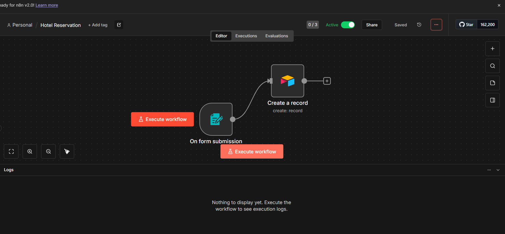

# 🏨 Hotel Reservation Automation System

A streamlined booking system built with **n8n** that captures guest reservations via a web form and instantly syncs them to an **Airtable** database.

## 📋 Project Overview

This workflow demonstrates how to build a serverless backend for a hotel booking system without writing a single line of frontend code.
1.  **Frontend:** Uses n8n's built-in "On Form Submission" trigger to generate a user-friendly booking interface.
2.  **Backend:** Processes the data (Guest Name, Room Type).
3.  **Database:** Automatically creates a new record in **Airtable** for reservation tracking.

## 🛠 Tech Stack

* **n8n** (Workflow Automation & Form Hosting)
* **Airtable** (Relational Database)
* **HTTP/Webhooks**

## 🚀 Setup Guide

### 1. Airtable Configuration
Before running the workflow, set up your Airtable Base:
* **Table Name:** `Reservations` (or Table 1)
* **Columns:**
    * `Name` (Single line text)
    * `Room` (Single Select: Single, Deluxe, Suite)

**🔑 Important: API Token Scopes**
When creating your Personal Access Token in Airtable, ensure you select the following scopes (permissions):
* `data.records:read`
* `data.records:write` (Crucial for adding new reservations)
* `schema.bases:read`

### 2. n8n Configuration
1.  Import the `workflow.json` file.
2.  Open the **Airtable Node** and set up your credentials using the Token created above.
3.  Map the Form fields (`name`, `room`) to the corresponding Airtable columns.
4.  **Activate** the workflow to get the **Production URL**.

## 📸 Workflow Screenshot

## 🧪 How to Test
1.  Open the **Production URL** provided by the Form Trigger node.
2.  Fill in the guest name and select a room type.
3.  Submit the form.
4.  Check your Airtable view; the new record should appear instantly.

## 🔮 Future Enhancements (AI Agent)
* **AI Confirmation:** Add an OpenAI node to generate a personalized welcome email based on the room type (e.g., suggesting VIP services for "Suite" guests).
* **Availability Check:** Connect to a Calendar API to prevent double-booking.

---
*Built with ❤️ by Mustafa*
